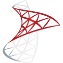
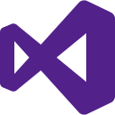
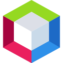
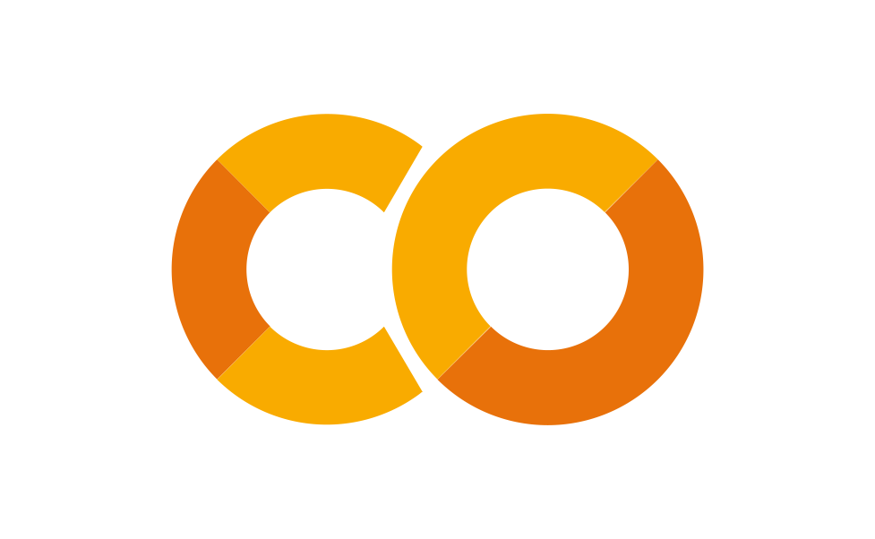
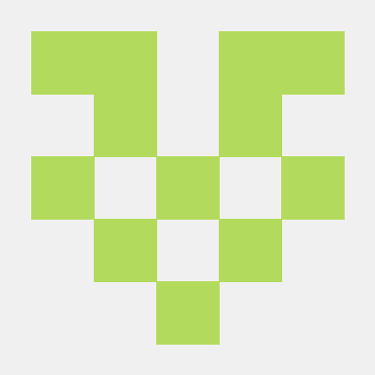

# Anas Emad - Software Developer

## 💡 Hero

Passionate about building real-world backend systems & secure applications

<h1 align="center">
  Hi  , I'm Anas Emad
</h1>

🚀 Backend Developer (Multi-stack: .NET + Python/Django, Java) | Cybersecurity Learner

<div align="center">
  <a href="https://github.com/anasemadanas" target="_blank">
  
  </a>
</div>

---

## 📌 Quick Navigation

- 👤 [About Me](#about-me)
- 🚀 [Featured Projects](#featured-projects)
- 🌱 [Currently Learning](#currently-learning)
- 🧠 [Problem Solving](#problem-solving)
- 🛠 [Skills](#skills)
- ⚙️ [Development Environment](#development-environment)
- ☁️ [Cloud & DevOps](#cloud--devops)
- 🎓 [Certifications](#certifications)
- 🎯 [Career Goals](#career-goals)
- 📬 [Contact](#contact-information)
- 📊 [GitHub Stats](#github-stats)

---

## 👤 About Me

```dart

class AboutMe extends Me {
  final Map<String, dynamic> personalInfo = {
    "FullName": "Anas Emad",
    "Title": "Software Engineer | Backend Developer | Cybersecurity Learner",

    "FocusAreas": [
      "Backend Development (.NET, Django)",
      "System Design & APIs",
      "Database Systems",
      "Cybersecurity & Malware Analysis"
    ],

    "Experience": [
      "Developed scalable .NET applications",
      "Built console-based games and web applications",
      "Designed and implemented backend systems using Django",
      "Solved 1000+ algorithmic challenges"
    ],

    "CurrentProjects": [
      "Expense Tracking System (Django Web App)",
      "Backend system architecture learning",
      "AI integration with backend systems"
    ],

    "TechnicalSkills": {
      "Languages": ["C++", "C#", "Java", "Python", "JavaScript"],
      "Web": ["HTML", "CSS", "Django", ".NET"],
      "Databases": ["SQL Server", "PostgreSQL", "MySQL"],
      "Tools": ["Git", "Docker (learning)", "Linux", "VMware"],
      "IDEs": ["Visual Studio", "VS Code", "NetBeans", "PyCharm"]
    },

    "Courses": {
      "Microsoft": [
        "MCSA",
        "MCSE",
        "AI-900 Azure AI Fundamentals",
        "Microsoft 365",
        "Microsoft Fabric"
      ],

      "Cloud & Security": [
        "AWS Cloud Practitioner",
        "CompTIA A+",
        "CompTIA Security+",
        "ICDL"
      ],

      "Engineering Concepts": [
        "SOLID Principles",
        "3-Tier Architecture",
        "Training of Trainers (TOT)"
      ]
    },

    "CybersecurityInterest": [
      "Malware Analysis Basics",
      "Network Security",
      "Wireshark Analysis"
    ],

    "Goals": [
      "Become a strong Backend Engineer",
      "Master System Design & Scalability",
      "Advance in Cybersecurity",
      "Build production-level systems"
    ],

    "Contact": {
      "Email":         "anasemadanas1@gmail.com",
      "LinkedIn":      "https://www.linkedin.com/in/eng-anasemad",
      "Reddit":        "https://www.reddit.com/user/anasemadanas1",
      "StackOverflow": "https://stackoverflow.com/users/32631412/anas-emad",
      "Discord":       "https://discord.com/users/559077785587679272",
      "ORCID":         "https://orcid.org/0009-0000-7569-8202",
      "Facebook":      "https://www.facebook.com/anasemadanas1"

    }
  };
}
```


---

## 🎬 Interests / Learning

💻 I'm a passionate **.NET Developer** with strong skills in **C++, C#, and Java**  

🚀 Focused on building **Scalable Systems**, **Web Applications**, **Console-based Games**, and **Algorithmic Solutions**  

🧠 **Clean Code Enthusiast** & Logical Problem Solver (**Solved 1000+ coding challenges**)  

🛠️ **Tech Stack:** C++, C#, Java, .NET Framework, SQL Server, HTML, CSS, JavaScript  

🔐 Interested in **Cybersecurity & Malware Simulation**  

🌱 Always learning and exploring **Advanced .NET, Node.js, Web Development, and System Programming**  

---

## 👨‍💻 Info
- 💻 Django Developer
- 📊 Building Money Manager App
- 🧠 Learning Backend & Databases
- 🚀 Interested in Full Stack & Cloud Development
- 🔗 Exploring AI integrations with backend systems

---

## 🚀 Featured Projects

### 💰 Expense Tracker System
- Django + PostgreSQL
- Authentication & Dashboard
- Financial analytics
- REST APIs

🔗 [Link Site](https://anasemad.pythonanywhere.com/)

### 🎮 Connect 4 Game
- JavaScript / HTML / CSS
- Interactive browser game
- Full game logic
- Hosted with GitHub Pages

🔗 [Play Game](https://anasemadanas.github.io/connect-4/)

---

## 🌱 Currently Learning 

- System Design & Scalability
- Docker & DevOps
- Malware Analysis
- Spring Boot & Microservices
- AI Integrations with Backend Systems
- Cloud Computing & Azure

---

## 🧠 Problem Solving 

- Solved 1000+ algorithmic challenges
- Strong understanding of Data Structures & Algorithms
- Focused on clean code and optimization
- Practicing competitive programming regularly
  
---


## 🚀 Live Website

Visit the portfolio here:

<p align="left">
  <a href="https://anasemadanas.github.io/anasemadanas" target="_blank">
    
  </a>
  
  <a href="https://github.com/anasemadanas">
    
  </a>
</p>

---
## 🛠 Skills

### 💻 Programming Languages
<p align="left">
  <a href="https://www.cprogramming.com/" target="_blank">
    
  </a>
  <a href="https://www.w3schools.com/cpp/" target="_blank">
    
  </a>
  <a href="https://docs.microsoft.com/dotnet/csharp/" target="_blank">
    
  </a>
  <a href="https://www.java.com/" target="_blank">
    
  </a>
  <a href="https://www.python.org/" target="_blank">
    
  </a>
  <a href="https://developer.mozilla.org/docs/Web/JavaScript" target="_blank">
    
  </a>
</p>

---

## ⚙️ Development Environment 

- OS: Windows, Ubuntu, Kali Linux
- IDEs: Visual Studio, VS Code, PyCharm, IntelliJ IDEA
- Tools: Git, Docker, VMware, Postman
- Databases: SQL Server, PostgreSQL, MySQL

---

## ☁️ Cloud & DevOps 

<p align="left">
  <a href="https://azure.microsoft.com/" target="_blank">
  
  </a>
  <a href="https://aws.amazon.com/" target="_blank">
  
  </a>
  <a href="https://www.docker.com/" target="_blank">
  
  </a>
  <a href="https://www.linux.org/" target="_blank">
  
  </a>
</p>

---

### 🚀 Backend & Frameworks
<p align="left">
  <a href="https://dotnet.microsoft.com/" target="_blank">
    
  </a>
  <a href="https://spring.io/projects/spring-boot" target="_blank">
    
  </a>
  <a href="https://www.djangoproject.com/" target="_blank">
    
  </a>
<a href="https://nodejs.org/" target="_blank">
  
</a>
</p>

### 🌐 Frontend Development
<p align="left">
  <a href="https://developer.mozilla.org/en-US/docs/Web/HTML" target="_blank">
    
  </a>

  <a href="https://developer.mozilla.org/en-US/docs/Web/CSS" target="_blank">
    
  </a>

  <a href="https://react.dev/" target="_blank">
    
  </a>
</p>

### 🗄️ Databases
<p align="left">
  <a href="https://www.microsoft.com/en-us/sql-server" target="_blank">
    
  </a>
  <a href="https://www.postgresql.org/" target="_blank">
    
  </a>
  <a href="https://www.mysql.com/" target="_blank">
    
  </a>
  <a href="https://www.sqlite.org/" target="_blank">
    
  </a>
  <a href="https://www.oracle.com/database/" target="_blank">
    
  </a>
  <a href="https://www.mongodb.com/" target="_blank">
  
</a>
</p>

### 🛠️ IDEs & Editors
<p align="left">
  <a href="https://visualstudio.microsoft.com/" target="_blank">
    
  </a>

  <a href="https://code.visualstudio.com/" target="_blank">
    
  </a>

  <a href="https://www.jetbrains.com/pycharm/" target="_blank">
    
  </a>

  <a href="https://www.jetbrains.com/idea/" target="_blank">
    
  </a>

  <a href="https://netbeans.apache.org/" target="_blank">
    
  </a>

  <a href="https://mrdoob.com/projects/chromeexperiments/google-gravity/" target="_blank">
    
  </a>

  <a href="https://github.com/getcursor/cursor" target="_blank">
    
  </a>

</p>

### 🔧 Development Tools
<p align="left">

  <a href="https://git-scm.com/" target="_blank">
    
  </a>

  <a href="https://github.com/" target="_blank">
    
  </a>

  <a href="https://www.docker.com/" target="_blank">
    
  </a>

  <a href="https://colab.research.google.com/" target="_blank">
    
  </a>

</p>

### 📐 UML & Design Tools
<p align="left">

<a href="https://plantuml.com/" target="_blank">
  
</a>

  <a href="https://www.diagrams.net/" target="_blank">
    
  </a>

<a href="https://www.microsoft.com/microsoft-365/visio/" target="_blank">
  
</a>

</p>

### 🧪 Testing Tools & Frameworks
<p align="left">

  <a href="https://www.postman.com/" target="_blank">
    
  </a>

  <a href="https://junit.org/junit5/" target="_blank">
    
  </a>

<a href="https://site.mockito.org/" target="_blank">
  
</a>

  <a href="https://pytest.org/" target="_blank">
    
  </a>

</p>

### 🖥️ GUI Development
<p align="left">

  <a href="https://www.qt.io/" target="_blank">
    
  </a>

  <a href="https://openjfx.io/" target="_blank">
    
  </a>

  <a href="https://docs.oracle.com/javase/tutorial/uiswing/" target="_blank">
    
  </a>

</p>

---

### 🖥️ Operating Systems
<p align="left">
  <!-- Windows -->
  <a href="https://www.microsoft.com/windows/" target="_blank">
    
  </a>
  
  <!-- macOS -->
  <a href="https://www.apple.com/macos/" target="_blank">
    
  </a>

  <!-- Kali Linux -->
  <a href="https://www.kali.org/" target="_blank">
    
  </a>

  <!-- Ubuntu -->
<a href="https://ubuntu.com/" target="_blank">
  
</a>

  <!-- Fedora -->
  <a href="https://fedoraproject.org/" target="_blank">
    
  </a>

  <a href="https://www.vmware.com/" target="_blank">
  
</a>

<a href="https://www.vmware.com/products/vsphere.html" target="_blank">
  
</a>

</p>

---

## 📚 Courses, Learning Journey & Technical Training

### 🌐 Cisco Networking Academy (NetAcad)

<p align="left">

<a href="https://www.netacad.com/" target="_blank">

</a>

<a href="https://www.netacad.com/" target="_blank">

</a>

<a href="https://www.netacad.com/" target="_blank">

</a>

<a href="https://www.netacad.com/" target="_blank">

</a>

<a href="https://www.netacad.com/" target="_blank">

</a>

<a href="https://www.netacad.com/" target="_blank">

</a>

<a href="https://www.netacad.com/" target="_blank">

</a>

<a href="https://www.netacad.com/" target="_blank">

</a>

<a href="https://www.netacad.com/" target="_blank">

</a>

<a href="https://www.netacad.com/" target="_blank">

</a>

<a href="https://www.netacad.com/" target="_blank">

</a>

<a href="https://www.netacad.com/" target="_blank">

</a>

<a href="https://www.netacad.com/" target="_blank">

</a>

<a href="https://www.netacad.com/" target="_blank">

</a>

<a href="https://www.netacad.com/" target="_blank">

</a>

</p>

---

### ☁️ Cloud, Microsoft & Security Learning

<p align="left">

<a href="https://learn.microsoft.com/" target="_blank">
  
</a>

<a href="https://learn.microsoft.com/en-us/training/" target="_blank">
  
</a>

<a href="https://www.comptia.org/certifications/a" target="_blank">
  
</a>

<a href="https://www.comptia.org/certifications/a" target="_blank">

</a>

<a href="https://www.comptia.org/certifications/a" target="_blank">

</a>

<a href="https://www.comptia.org/certifications/network" target="_blank">
  
</a>

<a href="https://www.comptia.org/certifications/cloud" target="_blank">
  
</a>

<a href="https://www.comptia.org/certifications/security" target="_blank">
  
</a>

<a href="https://www.comptia.org/certifications/security" target="_blank">

</a>

<a href="https://www.wireshark.org/" target="_blank">

</a>

<a href="https://www.netacad.com/" target="_blank">

</a>

<a href="https://aws.amazon.com/certification/certified-cloud-practitioner/" target="_blank">
  
</a>

<a href="https://aws.amazon.com/training/digital/aws-cloud-quest/" target="_blank">
  
</a>

<a href="https://learn.microsoft.com/en-us/fabric/" target="_blank">
  
</a>


</p>

---

### 🌐 Web Development & Software Engineering

<p align="left">

<a href="https://orange.jo/en/corporate/csr/coding-academy" target="_blank">

</a>

<a href="https://orange.jo/en/corporate/csr/coding-academy" target="_blank">

</a>

<a href="https://orange.jo/en/corporate/csr/coding-academy" target="_blank">

</a>

<a href="https://en.wikipedia.org/wiki/SOLID" target="_blank">

</a>

<a href="https://en.wikipedia.org/wiki/Multitier_architecture" target="_blank">

</a>

</p>

---

### 🎨 Creative, Productivity & Business Skills

<p align="left">

<a href="https://www.udemy.com/" target="_blank">

</a>

<a href="https://www.udemy.com/" target="_blank">

</a>

<a href="https://icdl.org/" target="_blank">

</a>

<a href="https://en.wikipedia.org/wiki/Training_of_trainers" target="_blank">

</a>

<a href="https://www.iiba.org/business-analysis-certifications/ccba/" target="_blank">

</a>

</p>

---

### 💻 ProgrammingAdvices Roadmap Courses

<p align="left">

<a href="https://programmingadvices.com/" target="_blank">

</a>

<a href="https://programmingadvices.com/" target="_blank">

</a>

<a href="https://programmingadvices.com/" target="_blank">

</a>

<a href="https://programmingadvices.com/" target="_blank">

</a>

<a href="https://programmingadvices.com/" target="_blank">

</a>

<a href="https://programmingadvices.com/" target="_blank">

</a>

<a href="https://programmingadvices.com/" target="_blank">

</a>

<a href="https://programmingadvices.com/" target="_blank">

</a>

<a href="https://programmingadvices.com/" target="_blank">

</a>

<a href="https://programmingadvices.com/" target="_blank">

</a>

<a href="https://programmingadvices.com/" target="_blank">

</a>

<a href="https://programmingadvices.com/" target="_blank">

</a>

<a href="https://programmingadvices.com/" target="_blank">

</a>

<a href="https://programmingadvices.com/" target="_blank">

</a>

<a href="https://programmingadvices.com/" target="_blank">

</a>

<a href="https://programmingadvices.com/" target="_blank">

</a>

<a href="https://programmingadvices.com/" target="_blank">

</a>

<a href="https://programmingadvices.com/" target="_blank">

</a>

<a href="https://programmingadvices.com/" target="_blank">

</a>

</p>

---

### 🎓 Edraak Courses

<p align="left">

<a href="https://www.edraak.org/" target="_blank">

</a>

<a href="https://www.edraak.org/" target="_blank">

</a>

<a href="https://www.edraak.org/" target="_blank">

</a>

<a href="https://www.edraak.org/" target="_blank">

</a>

<a href="https://www.edraak.org/" target="_blank">

</a>

<a href="https://www.edraak.org/" target="_blank">

</a>

<a href="https://www.edraak.org/" target="_blank">

</a>

<a href="https://www.edraak.org/" target="_blank">

</a>

<a href="https://www.edraak.org/" target="_blank">

</a>

<a href="https://www.edraak.org/" target="_blank">

</a>

<a href="https://www.edraak.org/" target="_blank">

</a>

<a href="https://www.edraak.org/" target="_blank">

</a>

</p>


---

> 📌 These represent completed courses, learning paths, certificates of completion, and self-study programs — not official international certifications unless explicitly verified.


---

## 🎓 Certifications

[](https://cs50.harvard.edu/certificates/46da5d62-c049-47a6-a77a-f4e31ec9da9b)
[](https://www.credly.com/users/anas-emad-sabri-al-shawiki)
[](https://learn.microsoft.com/en-us/credentials/certifications/azure-fundamentals/)
[](https://learn.microsoft.com/en-us/credentials/certifications/copilot-and-agent-administration-fundamentals/?practice-assessment-type=certification)
[](https://learn.microsoft.com/en-us/credentials/certifications/power-platform-fundamentals/)
[](https://learn.microsoft.com/en-us/credentials/certifications/azure-ai-fundamentals/)
[](https://learn.microsoft.com/en-us/credentials/certifications/azure-data-fundamentals/)
[](https://learn.microsoft.com/en-us/credentials/certifications/security-compliance-and-identity-fundamentals/)

---

## 🎯 Career Goals 

- Backend Engineering
- Secure System Design
- Cloud & DevOps
- AI-powered Applications
- Cybersecurity Research

---

### 🤖 AI & Machine Learning Tools

<p align="left">

<!-- AI Tools -->
<a href="https://ollama.com/" target="_blank">

</a>
<a href="https://github.com/anasemadanas" target="_blank">

</a>
<a href="https://github.com/LostRuins/koboldcpp" target="_blank">

</a>
</p>

### 🧠 LLMs & Models Experience

<p align="left">

<a href="https://qwenlm.github.io/" target="_blank">

</a>
<a href="https://www.deepseek.com/" target="_blank">

</a>
<a href="https://www.llama.com/" target="_blank">

</a>
<a href="https://mistral.ai/" target="_blank">

</a>

</p>

### 🌐 AI APIs & Platforms

<p align="left">

<a href="https://openrouter.ai/" target="_blank">

</a>
<a href="https://huggingface.co/" target="_blank">

</a>
<a href="https://www.together.ai/" target="_blank">

</a>
<a href="https://groq.com/" target="_blank">

</a>

</p>

---

<a id="contact-information"></a>

## 📬 Contact Information 

<p align="left">

[](mailto:anasemadanas1@gmail.com)
[](https://linkedin.com/in/eng-anasemad)
[](https://github.com/anasemadanas)
[](https://anasemadanas.github.io/)

<br>

[](https://www.credly.com/users/anas-emad-sabri-al-shawiki)
[](https://orcid.org/0009-0000-7569-8202)

<br>

[](https://anasemadanas.wordpress.com/)
[](https://anasemadanas.blogspot.com/)
[](https://anasemadanas1.wixsite.com/anas1)

</p>

---

## 🏆 GitHub Trophies 

<div align="center">
  <a href="https://github.com/anasemadanas" target="_blank">
  
  </a>
</div>

---

## 📊 GitHub Stats

<div align="center">
  <a href="https://github.com/anasemadanas?tab=repositories" target="_blank">
  
  </a>
</div>

---

## 🔥 GitHub Streak

<div align="center">
  <a href="https://github.com/anasemadanas" target="_blank">
  
  </a>
</div>

> ⚠️ **Note:** Top languages is only a metric of the languages my public code consists of and doesn't reflect experience or skill level.

---

## 📈 Activity Graph
<p align="center">
  <a href="https://github.com/anasemadanas" target="_blank">
  
  </a>
</p>

---

## 🏅 Badges
<p align="center">
  <a href="https://github.com/anasemadanas" target="_blank">
  
  </a>
  <a href="https://github.com/anasemadanas?tab=followers" target="_blank">
  
  </a>
  <a href="https://github.com/anasemadanas?tab=stars" target="_blank">
  
  </a>
</p>

---

## 🧠 Dev Quote
<p align="center">
  <a href="https://github.com/piyushsuthar/github-readme-quotes" target="_blank">
  
  </a>
</p>

---

## 🔥 Contribution Calendar
<p align="center">
  <a href="https://github.com/anasemadanas" target="_blank">
  
  </a>
</p>

---

## 🐍 Contribution Snake

[](https://github.com/anasemadanas)

---

## ⚔️ Profile Summary 

<div align="center">
  <a href="https://github.com/anasemadanas" target="_blank">
  
  </a>
</div>

<div align="center">
  <a href="https://github.com/anasemadanas" target="_blank">
  
  </a>
</div>

## 🔝 Back To Top

<p align="center"> 
  <a href="#anas-emad---software-developer"> 
     
  </a> 
</p>

<p align="center">
💙 Thank you for visiting my portfolio
</p>

<p align="center">
  <a href="https://github.com/anasemadanas" target="_blank">
      
  </a>
</p>
